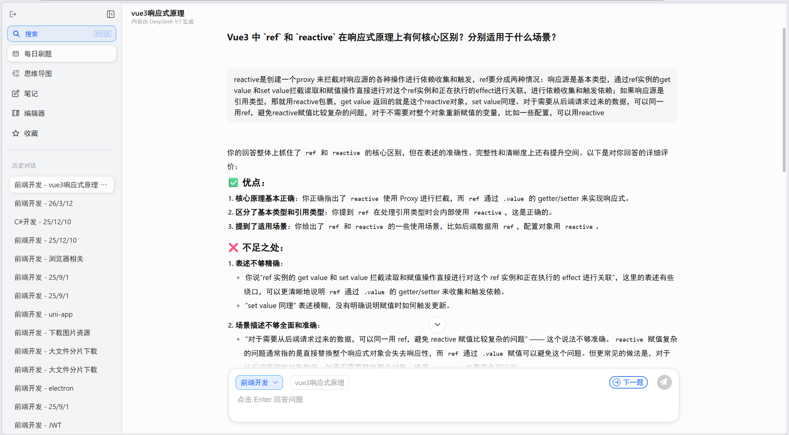
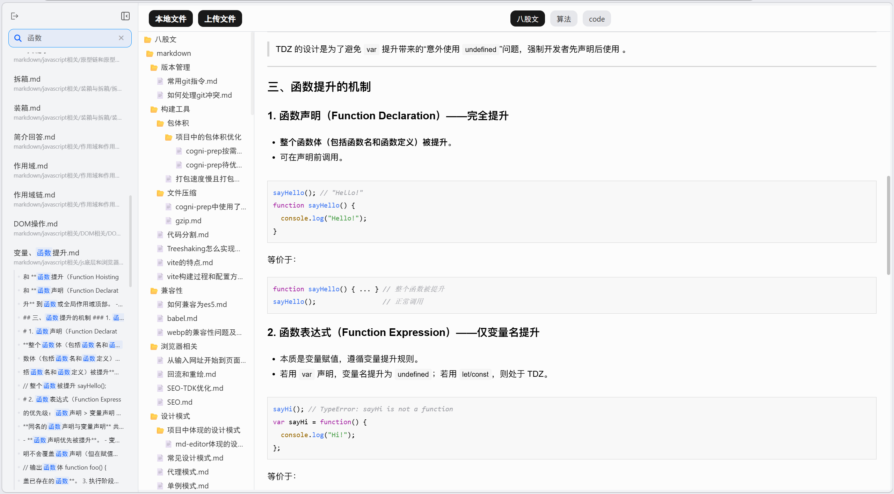
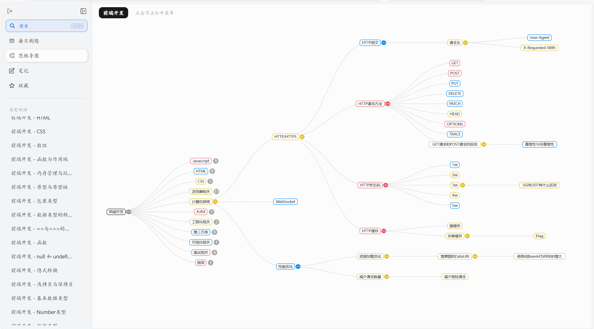
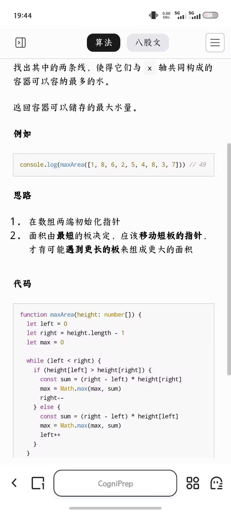

### 演示









## 核心实现

### 流式传输

前端采用fetch+ReadableStream读取流式数据，后端使用SSE格式发送数据

##### 后端

- 获取请求AI接口的response对象
- 获取response的body上的reader
- 使用docoder将reader返回的value二进制数据读取成字符串
- 通过循环不断将SSE格式的数据发送给前端

```
  try {
    // 设置响应头，告诉前端这是一个流式响应
    res.setHeader('Content-Type', 'text/event-stream')
    res.setHeader('Cache-Control', 'no-cache')
    res.setHeader('Connection', 'keep-alive')
    res.flushHeaders() // 发送头信息

    const response = await sendToMainAIStream(system, content)
    // console.log(response)

    if (!response.ok) {
      throw new Error(`Deepseek API request failed: ${response.statusText}`)
    }

    // 获取响应的可读流
    const reader = response.body.getReader()
    const decoder = new TextDecoder()

    // 监听客户端断开连接
    req.on('close', () => {
      console.log('Client disconnected, canceling stream')
      reader.cancel() // 取消读取流
    })

    // 循环读取流数据
    while (true) {
      const { done, value } = await reader.read()
      
      if (done) {
        res.write('data: [DONE]\n\n')
        res.end()
        break
      }

      const chunk = decoder.decode(value, { stream: true });
      const lines = chunk.split('\n').filter(line => line.trim() !== '')
      
      for (const line of lines) {
        // console.log('line', line)
        const dataStr = line.replace(/^data: /, '')
        
        if (dataStr === '[DONE]') {
          res.write(`data: ${dataStr}\n\n`)
          res.end()
          return
        }
        
        try {
          const data = JSON.parse(dataStr)
          if (data.choices && data.choices[0]?.delta?.content) {
            // console.log('AI返回结果', data.choices[0].delta.content)
            // 直接写入数据，流会自动处理缓冲
            res.write(`data: ${JSON.stringify({
              content: data.choices[0].delta.content
            })}\n\n`)
          }
        } catch (e) {
          console.error('Error parsing stream chunk:', e)
        }
      }
    }
  } catch (error) {
    useSpareAI(res, system, content)
    console.log(error)
  }
```

##### 前端

- 通过fetch 发送请求，读取response对象body上的reader


- 通过decoder解析reader的value值

```
const getStreamResponse = async (url: string, data: StreamRequestConfigType, chatId: number, msgType: ChatStatusType) => {
    // console.log('getStreamResponse', data)
    const chatMapValue = chatMap.get(data.sessionId)
    if (chatMapValue) chatMapValue.controller = new AbortController()

    // 保存信号，用于外部中断
    const abortSignal: AbortSignal | undefined  = chatMapValue?.controller?.signal

    const newText = reactive({
      content: '',
      id: chatId,
      messageType: msgType,
      sessionId: data.sessionId,
    })

    try {
      const baseUrl = import.meta.env.VITE_BASE_URL + url
      const headers: Record<string, string> = {
        'Content-Type': 'application/json'
      }
      if (userStore.token) {
        headers['Authorization'] = `Bearer ${userStore.token}`
      }

      const response: Response = await fetch(baseUrl, {
        method: 'POST',
        headers,
        body: JSON.stringify(data),
        signal: abortSignal // 关联中断信号
      })

      if (!response.ok) {
        throw new Error(`HTTP error! status: ${response.status}`)
      }

      if (!response.body) {
        throw new Error('Response body is null')
      }

      // 读取流式响应
      const reader = response.body.getReader()
      const decoder = new TextDecoder()

      const chatMapValue = chatMap.get(data.sessionId)
      if (!chatMapValue) return
      chatMapValue.chatList.push(newText)

      while (true) {
        const { done, value } = await reader.read()

        if (done) {
          setSendState('available', data.sessionId)
          saveChat(chatId, data.sessionId, newText.content, data, msgType)

          const chatMapValue = chatMap.get(data.sessionId)
          if (chatMapValue) chatMapValue.controller = null
          break
        }

        setSendState('streaming', data.sessionId)

        // 解析SSE格式数据（格式：data: [JSON]\n\n）
        const chunk = decoder.decode(value)
        const lines = chunk.split('\n\n') // 按SSE分隔符分割

        lines.forEach(line => {
          if (line.startsWith('data: ')) {
            const data = line.slice(6) // 去掉'data: '前缀
            if (data === '[DONE]') return // 结束标记
            const json: { content: string } = JSON.parse(data) // 解析为JSON
            // console.log('收到流式数据：', json)
            newText.content += json.content
          }
        })
      }
    } catch (err: any) {
      // 捕获中断错误（区别于其他错误）
      if (err.name === 'AbortError') {
        console.log('请求被主动中断')
      } else {
        console.error('请求错误:', err)
      }
    }
  }
```


### 不同对话状态隔离

使用Map管理每个对话

##### Map结构

```
const chatMap = reactive(new Map<number, ChatMapValueTpye>())

ChatMapValueTpye {
  chatList: ChatType[]
  backupChatList: ChatType[]
  sendState: SendStateType
  nextState: boolean
  controller: AbortController | null
}
```

##### 添加对话并合理控制Map对话的数量

```
const pushChatQueue = (currentSessionId: number, data: ChatMapValueTpye) => {
    const length = chatQueue.length
    if (length >= 5) {
      const removeId = chatQueue.shift() as number
      chatMap.get(removeId)?.controller?.abort()
      chatMap.delete(removeId)
    }
    chatMap.set(currentSessionId, data)
    chatQueue.push(currentSessionId)
  }
```

##### get与set当前对话的数据

```
  const displayChat = computed(() => chatMap.get(sessionId.value)?.chatList ?? [])
  const setDisplayChat = (value: ChatType[], currentSessionId: number) => {
    const chatMapValue = chatMap.get(currentSessionId)
    if (chatMapValue) chatMapValue.chatList = value
  }

  const sendState = computed(() => chatMap.get(sessionId.value)?.sendState ?? 'available')
  const setSendState = (value: SendStateType, currentSessionId: number) => {
    const chatMapValue = chatMap.get(currentSessionId)
    if (chatMapValue) chatMapValue.sendState = value
  }

  const nextState = computed(() => chatMap.get(sessionId.value)?.nextState ?? true)
  const setNextState = (value: boolean, currentSessionId: number) => {
    const chatMapValue = chatMap.get(currentSessionId)
    if (chatMapValue) chatMapValue.nextState = value
  }
```


### D3.js实现树状图

##### 数据处理

```
// 树结构原始数据
interface TreeNode {
  id: string
  name: string
  children: TreeNode[]
  isRoot?: boolean
  frequency: number
  isFolded: number
  chatId: number | null
  markId: number | null
}
```

##### 初始化图表

```
const initChart = () => {
  // 清空容器（防止重复渲染）
  d3.select(chartRef.value).selectAll('*').remove()

  const chartContainer = d3.select(chartRef.value)
  const element = chartContainer.node() as any

  // 固定画布尺寸
  chartWidth = element.clientWidth
  chartHeight = element.clientHeight

  // console.log(chartWidth, chartHeight)

  // 创建SVG容器
  svg = chartContainer
    .append('svg')
    .attr('width', chartWidth)
    .attr('height', chartHeight)
  
  // 创建可缩放/移动的图表组
  chartGroup = svg.append('g')

  // 存储当前变换状态
  currentTransform = d3.zoomIdentity

  // 初始化缩放行为
  zoom = d3.zoom()
    .scaleExtent([0.1, 5])
    .on('zoom', (event) => {
      currentTransform = event.transform
      chartGroup.attr('transform', currentTransform)
    })

  svg.call(zoom)
}

const updateData = async () => {
  const mindmap = await mindmapStore.getMindmapData()
  if (mindmap) treeData.value = mindmap
}
```

##### 渲染图表

- 手动删除isFolded > 0的节点的子节点
- 根据节点的深度和密度动态计算树应该占据的大小
- 对原始树结构数据使用hierarchy方法加工成d3可以渲染的树结构数据
- 使用d3.tree获得树结构的布局方法对root进行布局
- 使用d3.linkHorizontal方法进行连线、对每个节点进行绘制

```
const renderChart = () => {
  // 清除旧元素
  chartGroup.selectAll("*").remove()
  // console.log('treeData', treeData.value)

  // 加工原始数据(删除要折叠的节点的子节点)
  if (!treeData.value) return
  const foldedData = removeFoldedNodes(treeData.value)

  let sizeFactor = 1

  try {
    sizeFactor = calculateDynamicTreeSize(foldedData)
    // console.log('sizeFactor', sizeFactor)
  } catch (err) {
    console.log(err)
  }

  root = d3.hierarchy(foldedData)
  // console.log('初始化', root)

  const treeLayout = d3.tree()
    .size([chartHeight * sizeFactor, chartWidth * sizeFactor]) // 根据树的大小决定sizeFactor的大小调整树占据的尺寸

  treeLayout(root as d3.HierarchyNode<unknown>)

  // console.log('calculateDynamicTreeSize', calculateDynamicTreeSize(root))

  const svgDimensions = calculateSVGDimensions()

  if (!svgDimensions) return

  // 应用初始缩放
  applyInitialZoom(svgDimensions)

  // 绘制路径
  chartGroup.selectAll('.link')
    .data(root.links())
    .enter()
    .append('path')
    .attr('class', 'link')
    .attr('d', d3.linkHorizontal<d3.HierarchyLink<unknown>, d3.HierarchyPointNode<unknown>>()
      .x(d => d.y)
      .y(d => d.x)
    )

  // 创建节点组
  const node = chartGroup.selectAll('.node')
    .data(root.descendants())
    .enter()
    .append('g')
    .attr('class', 'node')
    .attr('transform', (d: any) => `translate(${d.y},${d.x})`)

  // 绘制节点的一些样式
  ......
```

##### 响应式调整

使用节流防止减少无效渲染，并且只在节流后进行函数调用

```
onMounted(async () => {
  initChart()
  await updateData()
  renderChart()

  const handleResize = throttle(() => adjustChartSize(), 500, { leading: false })

  // 监听页面尺寸
  resizeObserver.value = new ResizeObserver(() => {
    handleResize()
  })

  if (chartRef.value) {
    resizeObserver.value.observe(chartRef.value)
  }
})

// 调整图表尺寸
const adjustChartSize = () => {
  if (!chartRef.value || !svg) return
  
  // 获取新的容器尺寸
  const newWidth = userStore.isMobile ? chartRef.value.clientWidth * 1.75 : chartRef.value.clientWidth
  const newHeight = chartRef.value.clientHeight
  
  // 只有当尺寸真的发生变化时才更新
  if (newWidth !== chartWidth || newHeight !== chartHeight) {
    chartWidth = newWidth
    chartHeight = newHeight

    // 更新SVG尺寸
    svg.attr('width', chartWidth)
       .attr('height', chartHeight)

    // 重新计算布局并渲染图表
    renderChart()
  }
}
```


### markdown解析和语法高亮

##### 引入依赖

```
import { purifyText } from './purifyText'
import { marked } from 'marked'
import { markedHighlight } from "marked-highlight"
import hljs from 'highlight.js'
import 'highlight.js/styles/atom-one-light.css'
```

##### 配置marked

```
// 配置 marked 使用 highlight.js 高亮代码
marked.use(markedHighlight({
  langPrefix: 'hljs language-',
  highlight(code, lang) {
    const language = hljs.getLanguage(lang) ? lang : 'shell'
    return hljs.highlight(code, { language }).value
  }
}))
```

##### 解析markdown文本

```
// 处理代码块，添加头部标题
export const parseMarkdown = (content: string) => {
  if (typeof content !== 'string') {
    return ''
  }

  // 先解析原始Markdown
  let html = marked(content)

  const sanitizedHtml = purifyText(html as string)

  // 创建临时DOM元素处理HTML
  const tempDiv = document.createElement('div')
  tempDiv.innerHTML = sanitizedHtml

  return purifyText(tempDiv.innerHTML)
}
```

##### 添加代码块头部样式

```
// 找到所有代码块
  const codeBlocks = tempDiv.querySelectorAll('pre')
  
  codeBlocks.forEach((block) => {
    // 获取语言信息（从code标签的class中提取）
    const codeElement = block.querySelector('code')
    let language = 'text'

    if (codeElement) {
      const classList = codeElement.className.split(' ')
      classList.forEach(cls => {
        if (cls.startsWith('language-')) {
          // 提取并验证语言名称
          const lang = cls.substring(9).toLowerCase()
          // 只允许字母、数字和连字符
          if (/^[a-z0-9-]+$/.test(lang)) {
            language = lang
          }
        }
      })
    }

    // ##创建代码块头部##
    const header = document.createElement('div')
    header.className = 'code-block-header'

    const title = document.createElement('div')
    title.textContent = language

    const copyIcon = document.createElement('div')
    copyIcon.className = 'copy-btn'
    const image = document.createElement('img')
    image.src = copySvg
    image.className = 'icon'
    image.alt = '复制'
    // 防止图片加载失败的事件注入
    image.removeAttribute('onerror')
    copyIcon.appendChild(image)

    header.appendChild(title)
    header.appendChild(copyIcon)
    // ##创建代码块头部##

    // 将头部插入到pre内部，作为第一个元素
    if (block.firstChild) {
      block.insertBefore(header, block.firstChild)
    } else {
      block.appendChild(header)
    }
  })
```

##### 使用HTML净化库

```
import DOMPurify from 'dompurify'

// 配置DOMPurify允许的标签和属性，限制安全范围
const sanitizeOptions = {
  // 允许的HTML标签
  ADD_TAGS: ['h1', 'h2', 'h3', 'h4', 'h5', 'h6', 'p', 'a', 'ul', 'ol', 'li', 
             'strong', 'em', 'code', 'pre', 'blockquote', 'br', 'table', 
             'thead', 'tbody', 'tr', 'th', 'td'],
  // 允许的属性
  ADD_ATTR: ['class', 'href', 'src', 'alt', 'title'],
  // 禁止的标签
  FORBID_TAGS: ['script', 'iframe', 'video', 'audio', 'style'],
  // 禁止的属性
  FORBID_ATTR: ['onclick', 'onload', 'onerror', 'onmouseover', 'onfocus'],
  // 禁止未知协议，防止javascript:等危险协议
  ALLOW_UNKNOWN_PROTOCOLS: false,
  // 净化URL，确保链接安全
  SANITIZE_URI: true
}

export const purifyText = (text: string) => {
  return DOMPurify.sanitize(text, sanitizeOptions)
}
```

##### 使用mixin混入样式

```
@mixin code-box {
  /* 公共样式 */
  div {
    line-height: 1.9;
  }

  /* 代码块容器样式（框体效果） */
  pre {
    /* 基础框体样式 */
    background-color: var(--code-bgc);
    border: 1px solid var(--light-border-color-1);
    border-radius: 6px;
    margin: 16px 0;
    overflow-x: auto;
    font-family: "SFMono-Regular", Consolas, "Liberation Mono", Menlo, monospace;
  }

  /* 代码块内文本样式 */
  pre code {
    font-family: 'Consolas', 'Monaco', monospace;
    font-size: 14px;
    color: #24292e;
    background-color: var(--code-bgc);
  }

  /* 行内代码样式（与块级代码区分） */
  p code,
  li code {
    background-color: var(--code-bgc);
    padding: 0.2em 0.4em;
    border-radius: 3px;
    font-size: 85%;
    font-family: "SFMono-Regular", Consolas, "Liberation Mono", Menlo, monospace;
  }

  // 文本样式
  /* 列表样式（有序/无序列表） */
  ul,
  ol {
    // margin: 0 0 16px;
    padding-left: 18px; /* 左侧缩进，预留列表符号位置 */
  }

  ul {
    list-style-type: none; /* 无序列表默认圆点 */
  }

  ol {
    list-style-type: decimal; /* 有序列表默认数字 */
  }

  ul li::before {
    content: "";
    display: inline-block;
    width: 6px; /* 固定宽度，确保对齐 */
    height: 6px;
    border-radius: 50%;
    background-color: var(--text-color-4);
    margin: 0 12px 2px -15px;
  }

  ol li::marker {
    color: var(--text-color-3); /* 序号颜色（示例为深紫色） */
    font-weight: bold; /* 可选：加粗序号 */
    font-size: 0.9em;
  }

  a {
    color: var(--main-color); /* 链接蓝色 */
    text-decoration: none; /* 取消默认下划线 */
  }
}
```


### 懒加载

##### 懒加载Dialog

```
const AsyncDialogs = defineAsyncComponent(() => import('@/pages/Dialogs/index.vue'))

const hasUsedDialog = ref(false)
const stopDialogWatch = watch(
  () => userStore.showDialog,
  (newVal) => {
    // 当用户首次触发任何对话框显示时，标记为已使用，此时才会渲染 AsyncDialogs 并加载组件
    if (newVal && !hasUsedDialog.value) {
      hasUsedDialog.value = true
      stopDialogWatch()
    }
  }
)

<AsyncDialogs v-if="hasUsedDialog" :selectSession="selectSession" />
```

##### 路由懒加载

```
import { createRouter, createWebHistory } from 'vue-router'
import type { RouteRecordRaw } from 'vue-router'

import Layout from '@/pages/Layout/index.vue'
import Chat from '@/pages/ChatView/index.vue'

const routes: RouteRecordRaw[] = [
    {
      path: '/login',
      name: '登录',
      component: () => import('@/pages/Login/index.vue')
    },
    {
      path: '/',
      component: Layout,
      redirect: '/chat',
      children: [
        {
          path: 'chat',
          name: '每日刷题',
          component: Chat,
          meta: { keepAlive: true }
        },
        {
          path: 'chat/:sessionId',
          name: '会话',
          component: Chat,
          meta: { keepAlive: true }
        },
        {
          path: 'mindmap',
          name: '思维导图',
          component: () => import('@/pages/MindMap/index.vue')
        },
        {
          path: 'note',
          name: '笔记',
          component: () => import('@/pages/Note/index.vue'),
          meta: { keepAlive: true }
        },
        {
          path: 'prefer',
          name: '收藏',
          component: () => import('@/pages/Prefer/index.vue'),
          children: [
            {
              path: ':preferId',
              name: '收藏详情',
              component: () => import('@/pages/Prefer/PreferDetail.vue')
            }
          ]
        }
      ]
    }
  ]

const router = createRouter({
  history: createWebHistory(import.meta.env.BASE_URL),
  routes
})

router.beforeEach(async (to, _, next) => { 
  if (to.path === '/prefer') {
    // 预加载 about 页面的资源
    import('@/pages/Prefer/PreferDetail.vue').catch(() => {})
  }
  next()
})

export default router
```


## 代码规范

### 安装依赖

```
npm i @eslint/js eslint eslint-plugin-prettier eslint-plugin-vue eslint-config-prettier prettier typescript-eslint globals -D
```

### eslint.config.js

```
import eslint from '@eslint/js'
import globals from 'globals'
import tseslint from 'typescript-eslint'
import eslintPluginVue from 'eslint-plugin-vue'
import eslintConfigPrettier from 'eslint-config-prettier'

export default [
  {
    ignores: ['dist*', 'node_modules/*'],
  },

  eslint.configs.recommended, // js 推荐配置
  ...tseslint.configs.recommended, // ts 推荐配置
  ...eslintPluginVue.configs['flat/recommended'], // vue 推荐配置

  {
    languageOptions: {
      globals: {
        ...globals.browser, // 浏览器全局变量
      },
    },
  },
  {
    files: ['**/*.{js,mjs,cjs,ts,vue}'],
    rules: {
      // js 规则
      'no-unused-vars': 'off', // 未使用变量
      'no-multiple-empty-lines': 'error', // 多个空行
      'vue/html-indent': ['error', 2], // 缩进
      'semi': ['error', 'never'], // 分号
      'comma-dangle': ['error', 'always-multiline'], // 强制使用尾逗号（多行情况下）
      'object-curly-spacing': ['error', 'always'], // 强制在大括号中使用空格
      'array-bracket-spacing': ['error', 'never'], // 方括号中不使用空格
      'eqeqeq': ['error', 'always'], // 必须使用 === 和 !==
      'no-var': 'error', // 不允许使用 var 声明变量

      // ts 规则
      '@typescript-eslint/no-unused-vars': 'warn', // 未使用变量
      '@typescript-eslint/no-explicit-any': 'off', // 使用 any 类型
      '@typescript-eslint/no-unsafe-function-type': 'off', // 使用 unsafe 函数类型

      // vue 规则
      'vue/multi-word-component-names': 'off', // 组件的驼峰命名
      'quotes': ['error', 'single', { // Script 中的字符串使用单引号，并允许反引号
        'avoidEscape': true,
        'allowTemplateLiterals': true,
      }],
      'vue/html-quotes': ['error', 'double'], // Vue 模板中使用双引号
    },
  },

  // vue 规则
  {
    files: ['**/*.vue'],
    languageOptions: {
      parserOptions: {
        parser: tseslint.parser, // typescript项目需要用到这个
        ecmaVersion: 'latest',
      },
    },
  },

  // 关闭与 Prettier 冲突的规则
  eslintConfigPrettier,
]
```

### .prettierrc.json

```
{
  "singleQuote": true,                    // 单引号
  "semi": false,					    // 不使用分号
  "bracketSpacing": true,				 // 对象大括号加空格
  "printWidth": 100,					 // 每行代码的最大字符长度
  "htmlWhitespaceSensitivity": "ignore",   // HTML 文件中空白字符的敏感度
  "endOfLine": "auto",					 // 定义文件的行尾符
  "trailingComma": "es5",				  // 对象、数组等结构中最后一个元素后面是否添加逗号
  "tabWidth": 2,						 // 缩进空格数
  "arrowParens": "always"                  // 箭头函数的参数是否总是被括号包裹
}
```

### package.json

```
  "scripts": {
    "dev": "vite",
    "build": "vite build",
    "preview": "vite preview",
    "lint:check": "eslint src",
    "lint": "eslint src --fix",
    "format:check": "prettier src --check",
    "format": "prettier src --write"
  }
```

#### 


